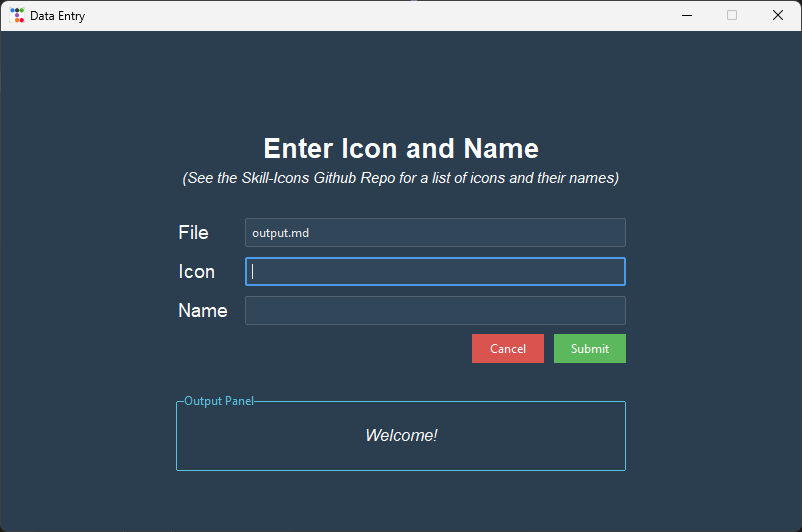

# Skill-Icons Table Maker
This is a project I came up with after designing my github profile [(check it out!)](https://github.com/JavonPeart)

The main purpose is to allow the creation of github tables in my preferred style without having to manually edit the markdown

If you want to make something similar and use this as your starting point you are allowed to do so

God Bless! ❤️

 

## Description
This project was made using the `TtkBootstrap` python library
>  ℹ️ ttkbootstrap remodels the original tkinter library to use bootstrap style themes

 
The GUI is incredible simple leaving room for much improvement. The backend is missing some useful usability features but I decided to stick with this simple design (maybe I'll come back to this in the future)  

> ℹ️ Please note that you can convert the finished code to an executable by using:  
> `C:\\> pyinstaller yourprogram.py --collect-all ttkbootstrap`

#### Features Included:
* File creation
* Updating existing files
* Preconstructed table format

#### Features not included:
* Editing (from UI)
* Table formatting (from UI)

 

## Screenshots

<h3>GUI</h3>

 

<h3>Sample Table</h3>

|  |  |  |  |  |  |  
|---|---|---|---|---|---|---
| 
 `C` 
 | 
 `C++` 
 | 
 `C#` 
 | 
 `Lua` 
 | 
 `Java` 
 | 
 `Python` 
 | 
 `VS Code` 
 

 

## References
- [ttkBootstrap](https://ttkbootstrap.readthedocs.io/en/latest/)
- [Skill-Icons Giithub](https://github.com/tandpfun/skill-icons#readme)
- [Pyinstaller Guide (StackOverflow)](https://stackoverflow.com/questions/67850998/ttkbootstrap-not-working-with-pyinstaller#:~:text=C%3A%5C%5C%3E%20pyinstaller%20yourprogram.py%20%2D%2Dcollect%2Dall%20ttkbootstrap)
